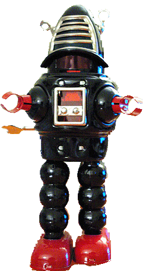

##Welcome

---

#Robotic Vision

---

#Section 1
##Robots revisited

---

#Robot: A definition

* A goal oriented machine that can **sense**, **plan** and **act**.
* A machine that moves (something) from A to B.

---

#Section 2
##Senses

---

##The 5 senses

* sight
* hearing
* smell
* touch
* taste

---

##And some unrevealed

----

##Balance

----

##Echo Location

----

##Electric Field

----

##Magnetism

---

#Section 3
##Why not use GPS?

---

<section data-background="images/land-robo.jpg"></section>

---

some slides to be inserted here...

---

---

#Section 4
##Vision

---

<section data-background="eye.jpg" style="text-align:left">
<h3>Let's talk about Vision?</h3>
<ul><li class="fragment">A long range sensor
<ul><li class="fragment">sense beyond our finger tips</li></ul></li>
<li class="fragment">Can sense shape, color, motion</li>
<li class="fragment">Eyes are useful/essential for the critical life tasks of all animals:<ul><li class="fragment">finding food</li>
<li class="fragment">avoiding being food</li>
<li class="fragment">finding mates</li></ul>
</li></ul>
</section>

---

