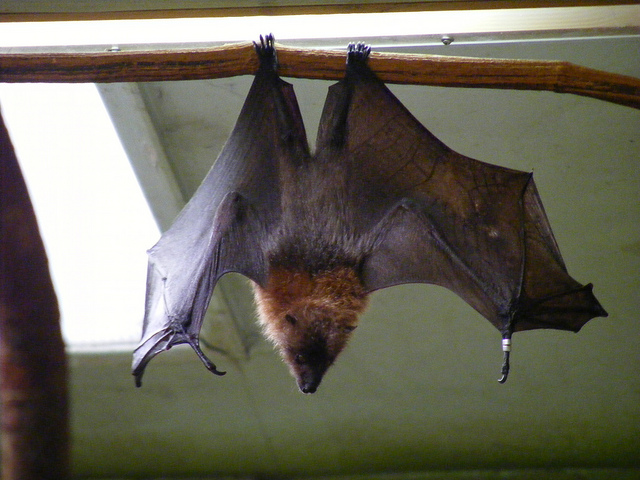

<section data-background="images/first.png"></section>
#Robotic Vision
>Guru Nanak Dev Engineering College

---

##Robot: *A definition*
- A *goal* oriented machine that can *sense*, *plan* and *act*. 
<!-- .element: class="fragment" data-fragment-index="1" -->

- A machine that *moves* (something) from A to B.
<!-- .element: class="fragment" data-fragment-index="2" -->

---

##The *5* senses

---

<section data-background="images/eye.jpg"></section>
> ##Sight

---

<section data-background="images/hear.jpg"></section>
> ##Hearing

---

<section data-background="images/smell.jpg"></section>
> ##smell

---

<section data-background="images/taste.jpg"></section>
> ##Hearing

---

<section data-background="images/touch.jpg"></section>
> ##Touch

---

##And some unrevealed...

----

##Balance

----

##Echo Location

----

##Electric Field

----

##Magnetism

---

####Section 3
#Why not use GPS?

---

<section data-background="images/land-robo.jpg"></section>

---

some slides to be inserted here...

---

####Section 4
#Vision

---

<section data-background="eye.jpg" style="text-align:left">
<h3>Let's talk about Vision?</h3>
<ul><li class="fragment">A long range sensor
<ul><li class="fragment">sense beyond our finger tips</li></ul></li>
<li class="fragment">Can sense shape, color, motion</li>
<li class="fragment">Eyes are useful/essential for the critical life tasks of all animals:<ul><li class="fragment">finding food</li>
<li class="fragment">avoiding being food</li>
<li class="fragment">finding mates</li></ul>
</li></ul>
</section>

---

<!-- vision images to be added here -->

---

####Section 5
#Evolution of vision

---

##The (amazing) sense of vision
The trilobites were among the most successful of all early animals, appearing 521 million years ago and roaming the oceans for over 270 million years.

---

<h2>Evolution of the eye</h2>
<ul type="square"><li class="fragment">Eye invented 540 million year ago</li>
<li class="fragment">10 different eye designs</li>
<li class="fragment">The lensed eye was invented 7 times</li></ul>
  

Vision <b>does need</b> a light source,  but we evolved next to  a <b>bright star</b>.

---

<section data-background="screenshots/6.1.png"></section>
<!-- Evolution of eye images goes here...... -->

---

<section data-background="screenshots/6.2.png"></section>

---

<section data-background="screenshots/6.3.png"></section>

---

<section data-background="screenshots/6.4.png"></section>

---

####Section 6
#Principles of Vision

---

####Section 7
#Human Vision

---

<section data-background="screenshots/7.1.png" class="fragment"></section>

---

<section data-background="screenshots/7.2.png" class="fragment"></section>

---

<section data-background="screenshots/7.3.png" class="fragment"></section>

---

<section data-background="screenshots/7.4.png" class="fragment"></section>

---

<section data-background="screenshots/7.5.png" class="fragment"></section>

---

<section data-background="screenshots/7.6.png" class="fragment"></section>

---

<section data-background="screenshots/7.7.png" class="fragment"></section>

---

<section data-background="screenshots/7.8.png" class="fragment"></section>

---

<section data-background="screenshots/7.9.png" class="fragment"></section>

---

<section data-background="screenshots/8.0.png" class="fragment"></section>

---

